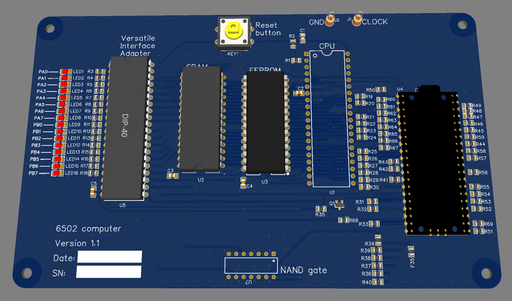

6502 computer
=============

.................................................

Components
----------

The standard RPi Pico:

* Official website: https://www.raspberrypi.com/products/raspberry-pi-pico/
* DigiKey: https://www.digikey.com/en/products/detail/raspberry-pi/SC0915/13624793

.....
..... IC soldered to board or IC sockets ..... should at least put the EEPROM in a socket .....
.....
.....

Licence
-------

Copyright © 2022 Phil Baldwin

This work is licensed under a Creative Commons Attribution-ShareAlike 4.0 International License.

You should have received a copy of the license along with this work. If not, see <http://creativecommons.org/licenses/by-sa/4.0/>.
